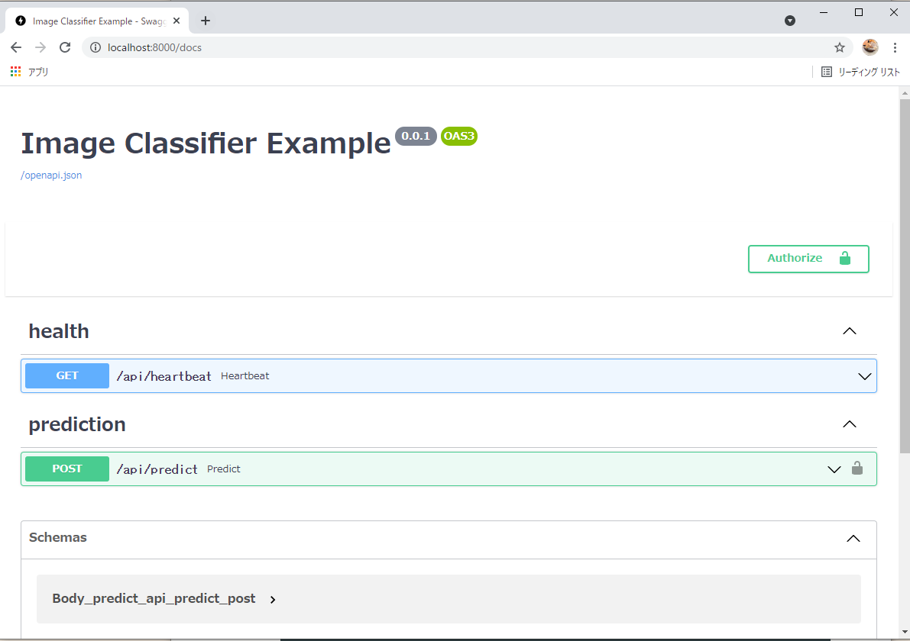
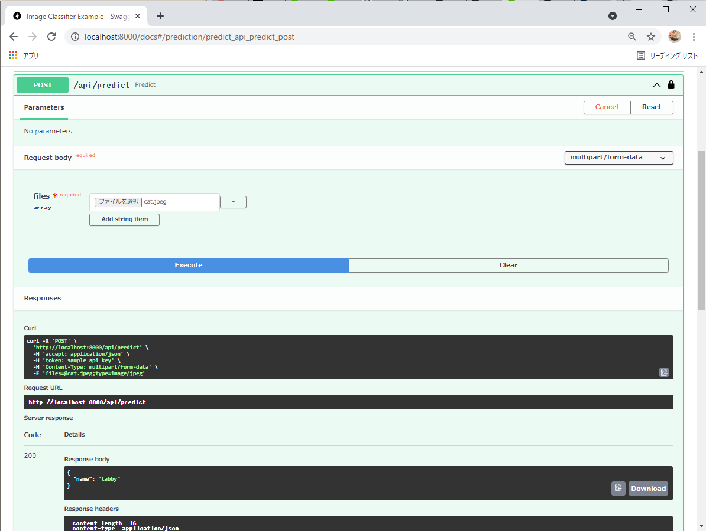

# ml-api-fastapi
API demo of running a Tensorflow model using FastAPI.


A sample of running ImageNet-based Resnet50 on Docker as a REST-API on FastAPI.
API demo of running a Tensorflow model using FastAPI.


# Demo




# Environment
- WSL2
- pipenv
- Docker


# Requirement
- tensorflow==2.3.0
- fastapi
- uvicorn
- Jinja
- aiofiles
- python-multipart
- opencv-python

All of these are listed in [requirements_prod.txt](./requirements_prod.txt).


# Usage

## Building the Development Environment
```
$git clone https://github.com/T-Sumida/ml-api-fastapi.git
$cd ml-api-fastapi
$pipenv install
```

## Model Create
```
$pipenv run create
```

SavedModel will be output under models.


## Docker Deploy
```
# build image
$pipenv run build

# start container
$pipenv run start


# stop container
$pipenv run stop
```
Go to [http://localhost:8000/docs](http://localhost:8000/docs)

For Authorize in the upper right corner of the docs, enter the value of API_KEY in the [.env file](./.env).


# Author
T-Sumida

