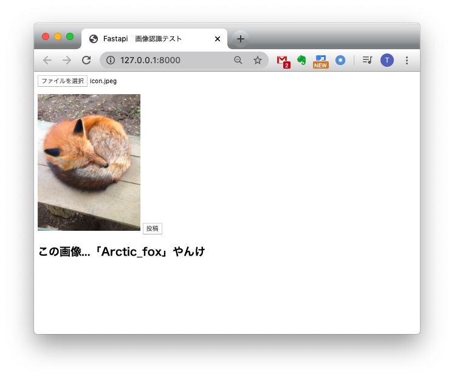

# ml-api-fastapi
Machine learning API implementation using fastapi

# Demo


# Environment
- Mac OS X Mojave
- Python3.7.1 (for anaconda3.5)


# Requirement
- tensorflow==1.14.1
- fastapi
- uvicorn
- Jinja
- aiofiles
- python-multipart
- opencv-python

All of these are listed in [requirements.txt](./requirements.txt)


# Usage
```
$git clone https://github.com/T-Sumida/ml-api-fastapi.git
$cd ml-api-fastapi
$pip install -r requirements.txt
$uvicorn server:app
```
Go to [http://localhost:8000](http://localhost:8000)


# Author
T-Sumida

https://qiita.com/komakomako/items/8efd4184f6d7cf1363f2
